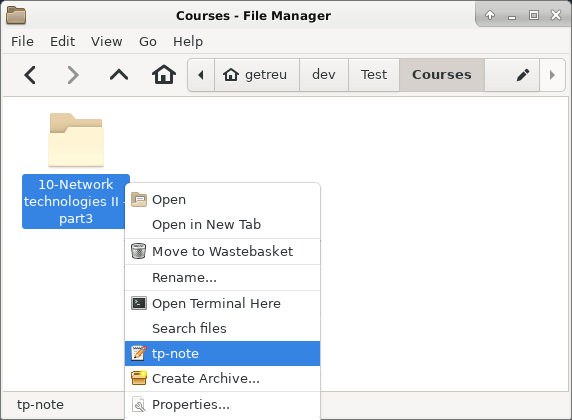

Markup languages like *Markdown*, *ReStructuredText*, *asciidoc*, *textile*,
*txt2tags* or *mediawiki* are perfectly suited for fast note-taking. Type
your notes with your favourite editor and chose your favourite markup
language[^1].

_Tp-Note_ helps you to quickly get started writing notes with its powerful
template system. As _Tp-Note_ takes care that the note's filename is always
synchronized with its document title, you will find back your notes easily.

The project is hosted on Gitlab:
[getreu/tp-note](https://gitlab.com/getreu/tp-note). The project's webpage is on
[http://blog.getreu.net](http://blog.getreu.net/projects/tp-note/).

## Fast start note-taking (when the lecture starts)

{width="12cm"}

Alternatively you can open the folder you want to create a new note in and
right-click on some empty white space.

[^1]: _Tp-Note_ is preconfigured to work with many well-known external text
editors: e.g.: `code`, `atom`, `retext`, `geany`, `gedit`, `mousepad`,
`leafpad`, `nvim-qt`, and `gvim` under Linux and `notpad++` and `notepad`
under Windows.  To register your own text editor, please consult the man-page.
For best user experience, I recommend a text editor with internal markup
previewer.

